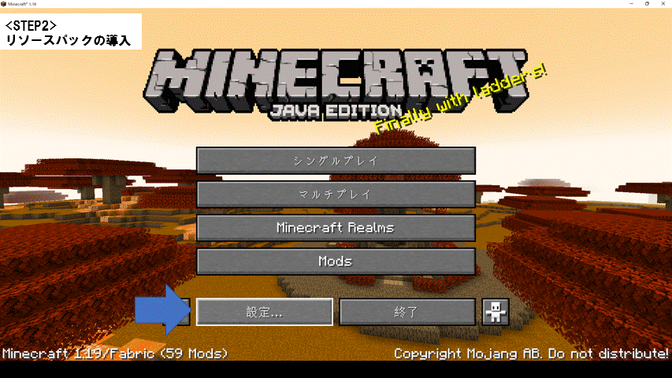
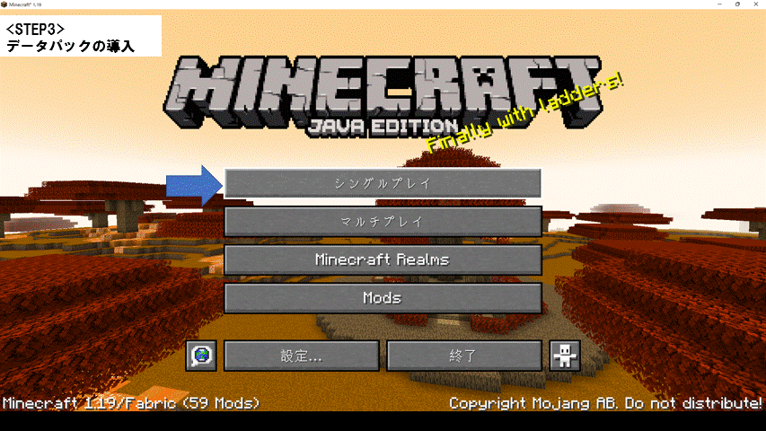

# InfinitePouchDataPack_for1.19.x
インフィニット(但しメモリの許す限り)

詳しい使い方はこちらの動画をご参照ください。
 
https://youtu.be/Ytn9dl77mU4
 
# アイテムの出し方
 
こちら現在開発中のデータパックのアイテムを無理やり引っ張りしてきたものになります。
 
その為現在は以下のコマンドでのみ取得可能となっています。
 
/loot give @p loot va_rm:item/carrot/infinite_pouch
 
もしどうしてもクラフトしたい場合は某ロボットの方のデタパをご活用ください。
 
 
# 【導入方法(データパック初心者向け)】 
## STEP1
右上にある緑色の"Code"をクリックして、"Download ZIP"からDL。
 
DLできたらまずはダウンロード用のフォルダに保存し、右クリック→すべて展開。
 
展開した中に2つの.zipファイルがある事を確認しよう。
 
 
## STEP2
マインクラフトを起動し、
 
「タイトル画面→設定→リソースパック→パックフォルダーを開く」
 
リソースパックフォルダを開いたら、ここに
 
導入したいリソースパックをコピーしよう。
 
「利用可能」にリソースパックが入ったはずだ。これを「選択中」に移動しよう。
 
 
 
## STEP3
「ワールド選択画面→ワールドを選択して「編集」→ワールドフォルダーを開く」
 
ワールドフォルダ開いたら"datapacks"の中に
 
導入したいデータパックをコピーしよう。これで導入は完了だ！
 
 
 
  
